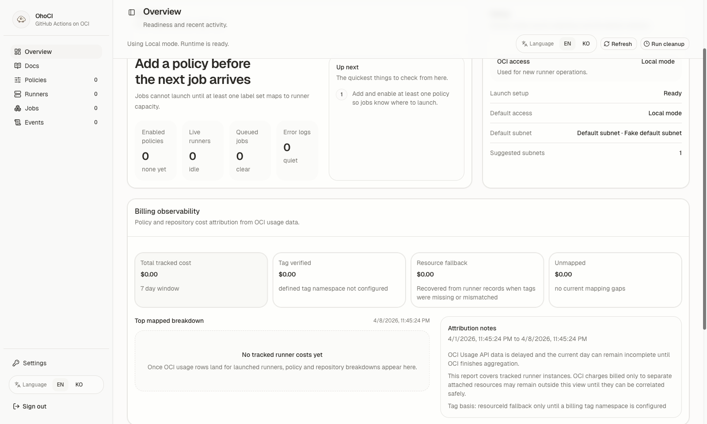

<p align="center">
  
</p>

# OhoCI

OhoCI is a self-hosted GitHub Actions runner manager for Oracle Cloud Infrastructure (OCI), aimed at individual operators and other small-scale setups. It receives `workflow_job` webhooks, explains admission decisions, starts ephemeral self-hosted runners on OCI when repository scope and labels match your policy, and gives one operator a web console for setup, policy management, and day-2 operations.

The target use case is simple: run frequent benchmark or CI jobs across different OCI shapes, OCPU and memory settings, and runner policies without paying to keep large idle fleets around. This project is meant for small personal or single-operator setups that want explainable admission, policy-level budget guardrails, and a narrow warm-capacity option without turning the control plane into a distributed system.

- **GitHub Actions burst capacity on OCI**
- **Ephemeral OCI runners for small operators**
- **A cheap benchmark and CI fleet on OCI spot or preemptible capacity**



If GitHub-hosted runners are too generic, static self-hosted runners stay idle too long, and ARC feels like too much Kubernetes for the job, OhoCI is the small-control-plane option for bursting onto OCI only when work arrives.

## How it works

```mermaid
flowchart LR
  A["GitHub sends a workflow_job webhook"]
  B["OhoCI checks setup readiness"]
  C["OhoCI checks repository scope"]
  D["OhoCI matches labels to a policy"]
  E["OhoCI checks capacity and budget"]
  F["OhoCI reuses warm capacity or launches an OCI instance"]
  G["The runner registers and attaches"]
  H["GitHub runs the job"]
  I["Job completes and cleanup removes the runner and instance"]
  A --> B --> C --> D --> E --> F --> G --> H --> I
```



Admission stays in a fixed order:

- setup readiness
- repository scope
- policy match
- capacity
- budget
- warm reuse
- launch and attach

Jobs diagnostics and policy compatibility checks surface the same order so an operator can explain exactly why a job launched, reused a warm runner, or stayed queued.

## When to use it

OhoCI is a good fit when you want:

- OCI-backed GitHub Actions capacity that starts only when jobs need it
- repository-scoped ephemeral runners instead of long-lived shared runners
- one small operator-managed deployment on one VM or one containerized OhoCI instance
- frequent benchmark or test runs across different OCI hardware profiles and runner policies
- OCI spot or preemptible capacity for interruptible workloads, which Oracle prices at 50% less than on-demand capacity

OhoCI is not an enterprise platform. It does not provide HA or active-active multi-replica support, even though one OhoCI instance can launch many runners in parallel.

## Why this instead of the usual options?

| Option | Best when | Why OhoCI is different |
| --- | --- | --- |
| GitHub-hosted runners | You want the default path and do not care which hardware runs the job. | OhoCI is for cases where you want OCI shapes, OCI networking, and OCI spot/preemptible cost control. |
| Long-lived self-hosted runners | You have steady usage and do not mind paying for always-on machines. | OhoCI launches ephemeral runners only when jobs arrive, then cleans them up. |
| actions-runner-controller (ARC) | You already run Kubernetes and want runner orchestration inside that cluster. | OhoCI is simpler when you do not want a Kubernetes control plane just to burst GitHub Actions jobs onto OCI. |
| Managed CI compute such as Depot | You prefer a hosted service and do not need the control plane in your own OCI account. | OhoCI is for operators who want OCI-native cost, shape, and network control in a self-hosted system. |
| Manually managed OCI VMs | You only need a few fixed runners and are fine handling registration and cleanup yourself. | OhoCI automates the webhook-to-launch-to-cleanup loop so the fleet does not become manual toil. |

## Quick start

### Local run

1. Copy the example environment. It now defaults to a localhost-safe base URL and a repo-local SQLite file so `go run` works without writing into `/var/lib`.
2. Build the frontend once.
3. Start the server.

```bash
cp deploy/.env.example deploy/.env
set -a
source deploy/.env
set +a
cd web && npm install && npm run build
cd ..
go run ./cmd/ohoci
```

Open `http://localhost:8080` after the server starts.

Before you use anything beyond a throwaway local test, replace the placeholder secrets in `deploy/.env` and set real GitHub App and OCI values.

`go run` serves the built UI from `./web/dist` by default. If you package the frontend elsewhere, point `OHOCI_UI_DIR` at that built directory.

### Container run

The repository includes a simple Compose path under `deploy/` for a single-node deployment with local SQLite storage and a Caddy reverse proxy:

```bash
cp deploy/.env.example deploy/.env
docker compose --env-file deploy/.env -f deploy/docker-compose.yml up -d
```

For a real deployment, edit `deploy/.env` before you start:

- set `OHOCI_PUBLIC_BASE_URL` to the public HTTPS URL
- set `OHOCI_PUBLIC_HOSTNAME` to the hostname Caddy should serve
- replace the placeholder secrets

`deploy/docker-compose.yml` defaults to `ghcr.io/sigee-min/ohoci:latest`. If you want to build from local source first, run `./deploy/build-image.sh` and then start Compose with `OHOCI_IMAGE=ohoci:local`.

## First login and setup

The bootstrap administrator is:

- username: `admin`
- password: `admin`

On the first sign-in, change that password immediately and finish the guided setup before expecting runner launches to work.

Prepare these inputs before setup:

- a GitHub App registration and installation
- an OCI config file and private key
- the repositories you want OhoCI to manage
- OCI launch target values such as compartment, subnet, and image

The first-run path is fixed:

1. Change the bootstrap admin password.
2. Verify and save the GitHub App route.
3. Save one OCI credential.
4. Choose at least one repository.
5. Save the OCI launch target.

During setup, the app stays in one setup shell and only shows the current task plus a short checklist. Jobs stay locked until the live GitHub route, local repository allowlist, and OCI launch target are all ready.

Repository scope is intentionally narrow: OhoCI only manages the intersection of the GitHub App installation scope and the repositories you select locally.

OhoCI records GitHub scope drift from installation webhook updates and a 15-minute reconcile loop. It does not auto-prune your local repository selection when GitHub visibility changes.

If you save the GitHub App without a preseeded webhook secret, OhoCI generates and stores one automatically.

Advanced GitHub and OCI operations stay in Settings after setup is complete.

## Deployment options

### Single VM or single container

This is the default deployment model for OhoCI's intended use case: one operator and one OhoCI instance.

- run one OhoCI process
- keep SQLite on a local persistent disk
- point `OHOCI_SQLITE_PATH` at that local file
- terminate public HTTPS in front of the app for both the admin UI and GitHub webhooks
- keep the control plane single-node only; there is no distributed locking or multi-replica coordination in this version

### Kubernetes

Kubernetes is valid when you still operate OhoCI as a single instance. It is not an HA mode.

- run exactly one replica
- set `OHOCI_PUBLIC_BASE_URL` to the external HTTPS URL
- narrow `OHOCI_TRUSTED_PROXY_CIDRS` to the real ingress or load balancer source ranges
- prefer MySQL through `OHOCI_DATABASE_URL` for Kubernetes operations

There is no leader election or replica coordination for webhook intake, budget snapshots, warm capacity, or cleanup. More than one active replica can race.

A starting point lives at [deploy/k8s/mysql-deployment.example.yaml](deploy/k8s/mysql-deployment.example.yaml). It keeps bootstrap secrets in a Kubernetes `Secret`, non-secret runtime settings in a `ConfigMap`, runs one replica, and includes a `Service` plus `Ingress` around a MySQL-backed deployment.

Do not run multiple replicas against the same SQLite file, and do not place SQLite on shared storage such as NFS.

### Configuration ownership

OhoCI keeps the operating model simple:

- environment variables own deployment bootstrap and process-level settings
- the database owns mutable operator-managed GitHub and OCI state
- OCI runtime target settings merge environment defaults with saved UI overrides

## Where the docs live

You can read the same operator-facing docs in two places:

- public docs at `/docs`
- the in-app **Docs** view after sign-in

The checked-in guides are:

- [docs/setup-guide.md](docs/setup-guide.md): complete the first-run onboarding flow
- [docs/getting-started.md](docs/getting-started.md): workspace tour after setup
- [docs/policies-and-capacity.md](docs/policies-and-capacity.md): matching rules, concurrency, and runner capacity
- [docs/operations-and-billing.md](docs/operations-and-billing.md): day-2 operations and OCI cost signals
- [docs/troubleshooting.md](docs/troubleshooting.md): common setup and runtime failures

## Development notes

For local development, the normal loop is:

```bash
go test ./...
cd web && npm install && npm run build
go run ./cmd/ohoci
```

If you build the container locally with `./deploy/build-image.sh`, the image packages the React UI and serves it from `OHOCI_UI_DIR=/var/lib/ohoci/ui` by default.
